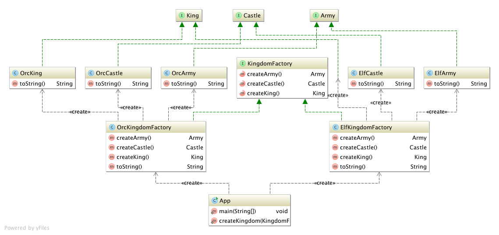

# Abstract Factory

## Ident

Provide an interface for creating families of related or dependant objects without specifying their concrete classes.

## Applicability

Use the abstract factory pattern when:

 - A system should be independent  of how its products are created, composed and represented.
 - A system should be configured with one of multiple families of products.
 - A family of related product objects is designed to be used together, and you need to enforce this constraint.
 - You want to provide a class library of products, and you just want to reveal their interfaces not their implementations.

