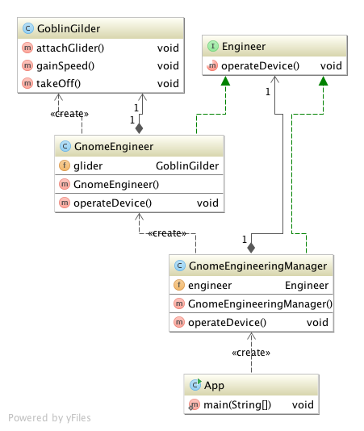

# Adapter

## Ident

Convert the interface of a class into another interface the clients expect. Adapter lets classes work together that couldn't otherwise because of incompatible interfaces.

## Applicability

Use the adapter pattern when

 - You want to use an existing class, and its interface does not match the one you need.
 - You want to create a reusable class that cooperates with unrelated or unforeseen classes, that is, classes that don't necessarily have compatible interfaces.
 - You need to use several existing subclasses, but it's impractical to adapter their interface by subclassing everyone. An object adapter can adapt the interface of its parent.

