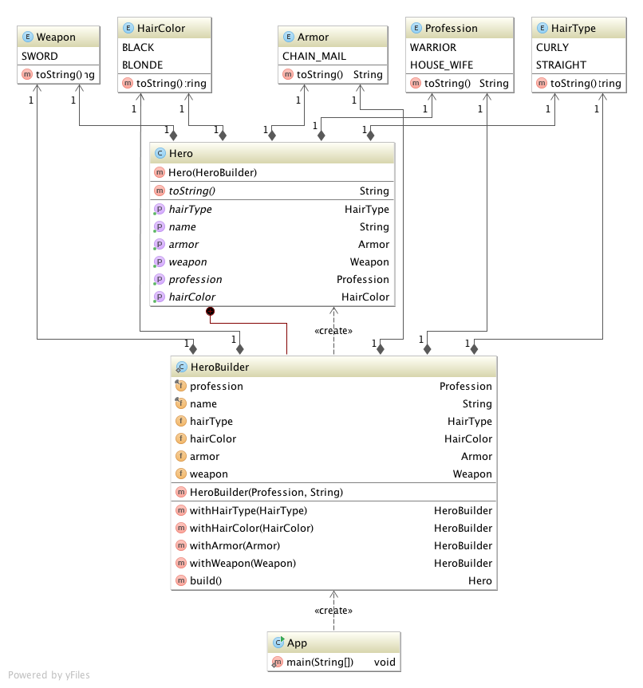

# Builder

## Ident

Separate the construction of a complex object from its representation so that the same construction process can create different representations.

## Applicability

Use the builder pattern when:

 - The algorithm for creating a complex object should be independent of the parts that make up the object and how they're assembled.
 - The construction process must allow different representations for the object that is constructed.

