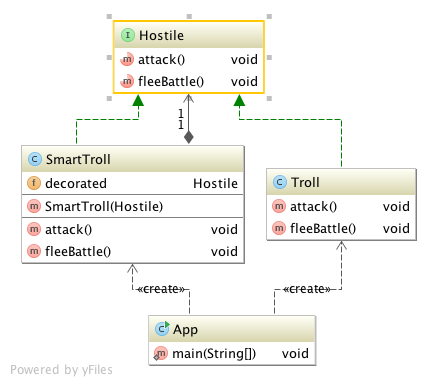

# Decorator

## Ident

Attach additional responsibilities to an object dynamically. Decorators provide a flexible alternative to subclassing for extending functionality.

## Applicability

Use the decorator pattern when:

 - To add responsibilities to individual objects dynamically and transparently, that is, without affecting other objects.
 - For responsibilities that can be withdrawn
 - When extension by subclassing is impractical. Sometimes a large number of independent extentions are possible and would produce an explosion of subclasses to support every combination. Or a class definition may be hidden or otherwise unavailable for subclassing.

