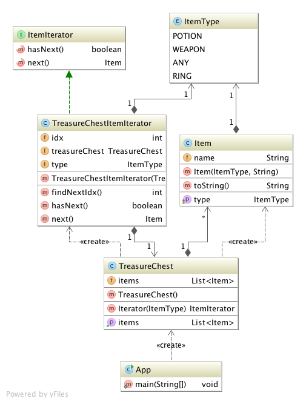

# Iterator

## Ident

Provide a way to access the elements of an aggregate object sequentially without exposing its underlying representation.

## Applicability

Use the iterator pattern to:

 - access an aggregate object's contents without exposing its internal representation
 - support multiple traversals of aggregate objects
 - provide a uniform interface for traversing different aggregate structures

