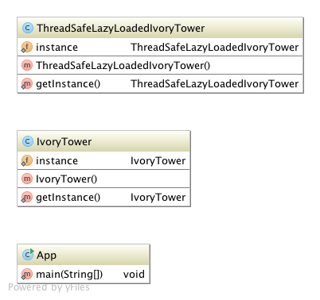

# Singleton

## Ident

Ensure a class only has one instance, and provide a global point to access it.

## Applicability

Use the singleton pattern when:

 - There must be exactly one instance of a class, and it must be accessible to clients form a wellknown access point.
 - When the sole instance should be extensible by subclassing , and clients should be able to use an extended instance without modifying their code.

